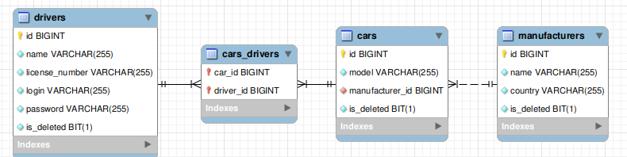

# taxi-service

This project provide simple example how to create Web Application using  **Java EE Servlets**, **JSP**, and **JSTL** and **MySQL** as A relational database.
The base functionality provided by this application allow use application as base for more advanced application.

## Project overview
### Components
 - Apache Tomcat | 9.0.65
 - Java EE 11
 - MySQL 8.0.30
### Tchnologies
 - JavaServer Pages (JSP)
 - JavaServer Pages Standard Tag Library (JSTL)
 - Servlet WebFilter

### Database architecture

### Description of the project
Application provide  following oportunities:
- Registration user by himself.
- Authentification  by login password
- Create records for Driver, Car and car Manufacturers
- Assign Driver to Car.
- get list of Drivers, Cars, Manufacturers.
- get list of Car where current user assigned

Link for live testing <a href="http://examples.mooo.com/taxi-service/login">Live test</a>

### Installation process
 - install IntelliJ IDEA on your PC
 - Create new project in IntelliJ IDEA use menu File -> New -> Project from Version Control  copy past and insert git url for this project 
 - install MySQL 8.0.3 on your PC
 - Configure **taxi/util/ConnectionUtil.java** set your mysql location user and password.
 - run following script in mysql **src/main/resources/init_db.sql**
   
   Go ahead ! Have a fun!

 

